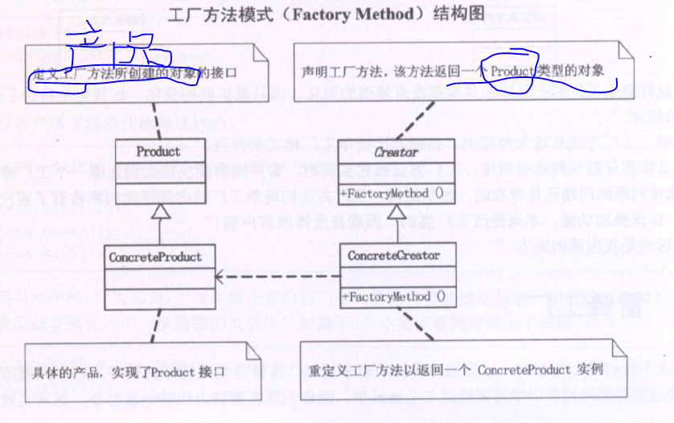

### 工厂方法模式（FACTORY METHOD）
是一种常用的对象创建型设计模式,此模式的核心精神是封装类中不变的部分，提取其中个性化善变的部分为独立类，
通过依赖注入以达到解耦、复用和方便后期维护拓展的目的。它的核心结构有四个角色，分别是**抽象工厂； 具体工厂；抽象产品；具体产品。**

工厂方法模式和简单工厂模式的区别是,
    简单工厂模式有一个工厂类,他负责创建不同的对象.
    工厂方法模式将这个工厂类再次抽象,有一个抽象的工厂类,然后具体的创建不同对象的过程移到了这个抽象工厂的子类中完成.
    然后客户端需要创建这个工厂子类的对象,传递给工厂抽象父类.由抽象工厂对象来操作.
    
    
  简单工厂模式最大优点是工厂类中包含了必要的逻辑判断,根据客户端的选择条件动态的实例化相关的产品类,对于客户端来说,去除了与具体产品类的依赖.
    如果我们需要对产品进行增加修改,那么必须要修改工厂类,就违背了开闭原则,最好不要修改已有类.
  工厂方法模式:使一个类的实例化延迟到了他的子类.
  
  