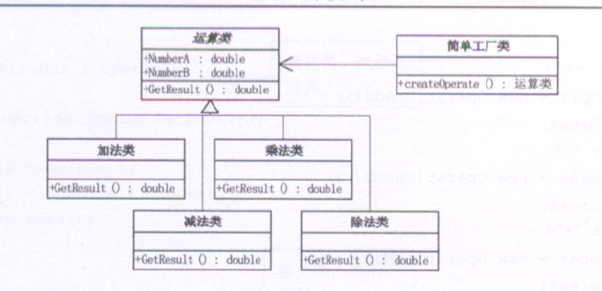

##### 读大话设计模式有感:  
   简单设计模式就是 最基础的面向对象的写法.  

   利用工厂类来创建对象,实现松耦合.  
    　简单工厂模式的实质是由一个工厂类根据传入的参数，动态决定应该创建哪一个产品类（这些产品类继承自一个父类或接口）的实例。  
    　　该模式中包含的角色及其职责  
    　　工厂（Creator）角色  
    　　简单工厂模式的核心，它负责实现创建所有实例的内部逻辑。工厂类可以被外界直接调用，创建所需的产品对象。  
    　　抽象（Product）角色  
    　　简单工厂模式所创建的所有对象的父类，它负责描述所有实例所共有的公共接口。  
    　　具体产品（Concrete Product）角色  
    　　简单工厂模式的特点:  
    　　简单工厂模式的创建目标，所有创建的对象都是充当这个角色的某个具体类的实例。  
    　　在这个模式中，工厂类是整个模式的关键所在。它包含必要的判断逻辑，能够根据外界给定的信息，决定究竟应该创建哪个具体类的对象。用户在使用时可以直接根据工厂类去创建所需的实例，而无需了解这些对象是如何创建以及如何组织的。有利于整个软件体系结构的优化。
    　　不难发现，简单工厂模式的缺点也正体现在其工厂类上，由于工厂类集中了所有实例的创建逻辑，所以“高内聚”方面做的并不好。另外，当系统中的具体产品类不断增多时，可能会出现要求工厂类也要做相应的修改，扩展性并不很好。