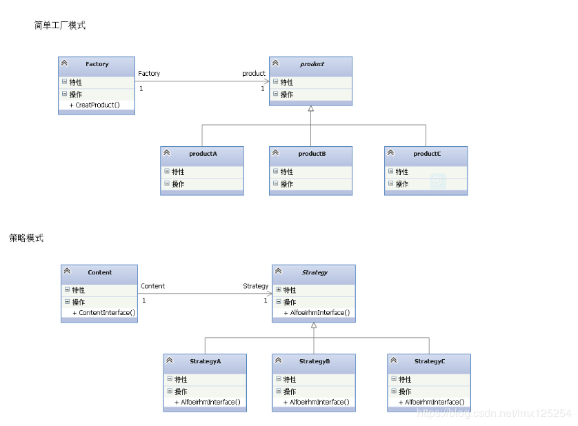

刚刚接触设计模式的时候，我相信单例模式和工厂模式应该是用的最多的，毕竟很多的底层代码几乎都用了这些模式。自从接触了一次阿里的公众号发的一次文章关于 DDD的使用 以后，就逐渐接触了策略模式。现在在项目中运用最多的也是这几种设计模式了，用了设计模式给我的感受就是感觉代码没那么冗余了，再注入一点贫血，充血模型之后，感觉在 service 层面代码看上去很舒服很简洁。

    
   首先，我个人感觉策略模式和我们常说的微服务我觉得思想上很像，尤其记得当时介绍DDD时候的举例说的是关于银行的转账案例，用的事务和领域驱动设计做的比较，让人一目了然的逻辑，代码也再也没有那么冗余了。（具体的文章地址找不到了，不过网上现在比较多的介绍DDD的，大体意思是一样的）

 其实工厂模式和设计模式一直给人一种错觉，总感觉是一样的，没有丝毫的区别。可以看下两种模式的UML图
 

   从图上来看，并没有多大的区别，话不多说，从具体的代码入手。

   先写一个人的接口类，有eat，run，wear 3个方法

    public interface People {
     
        public void eat();
     
        public void run();
     
        public void wear();
    }

分别写两个实现类，一个是小明的实现类，一个是小红的实现类

  

    public class Xiaoming implements People{
     
        @Override
        public void eat() {
            System.out.println("小明吃饭");
        }
     
        @Override
        public void run() {
            System.out.println("小明跑步");
        }
     
        @Override
        public void wear() {
            System.out.println("小明穿衣");
        }
    }
     
     
    public class Xiaohong implements People{
     
        @Override
        public void eat() {
            System.out.println("小红吃饭");
        }
     
        @Override
        public void run() {
            System.out.println("小红跑步");
        }
     
        @Override
        public void wear() {
            System.out.println("小红穿衣");
        }
    }

简单工厂模式的代码

    

    public class PeopleFactory {
     
        public People getPeople(String name){
            if(name.equals("Xiaoming")){
                return new Xiaoming();
            }else if(name.equals("Xiaohong")){
                return new Xiaohong();
            }
            return null;
        }
    }

再来看下策略模式的代码

   

    public class StrategySign {
     
        private People people;
     
        public StrategySign(People people){
            this.people = people;
        }
     
        public StrategySign(String name){
            if(name.equals("Xiaoming")){
                this.people = new Xiaoming();
            }else if(name.equals("Xiaohong")){
                this.people = new Xiaohong();
            }
        }
     
        public void run(){
            people.run();
        }
    }

  策略模式的两种构造方法都可以用，我多写了一种是为了让大家看到和工厂模式的区别和联系

  然后我们通过测试类运行两种模式

    @Test
        public void testSign(){
            PeopleFactory peopleFactory = new PeopleFactory();
            People people = peopleFactory.getPeople("Xiaohong");
            System.out.print("工厂模式-------------"); people.run();
            StrategySign strategySign = new StrategySign("Xiaohong");
            System.out.print("策略模式-------------");strategySign.run();
        }

      

可以看到，两种设计模式的运行结果是一模一样的，那么区别到底在哪呢。

   从工厂模式的代码中可以看到 工厂模式主要是返回的接口实现类的实例化对象，最后返回的结果是接口实现类中的方法，而策略模式是在实例化策略模式的时候已经创建好了，我们可以再策略模式中随意的拼接重写方法，而工厂模式是不管方法的拼接这些的，他只关注最后的结果，不注重过程，而策略模式注重的是过程。

   用一个具体的例子可以看下，如果我想小红先吃饭再跑步再吃饭的话，那么我需要在测试类中写3种，而我只需要在策略模式的方法中直接定义即可。

   可以看以下代码：

    public class StrategySign {
     
        private People people;
     
        public StrategySign(People people){
            this.people = people;
        }
     
        public StrategySign(String name){
            if(name.equals("Xiaoming")){
                this.people = new Xiaoming();
            }else if(name.equals("Xiaohong")){
                this.people = new Xiaohong();
            }
        }
     
        public void run() {
            people.eat();
            people.run();
            people.eat();
        }
    }
     
    @Test
        public void testSign(){
            PeopleFactory peopleFactory = new PeopleFactory();
            People people = peopleFactory.getPeople("Xiaohong");
            System.out.print("工厂模式-------------"); people.eat();
            System.out.print("工厂模式-------------"); people.run();
            System.out.print("工厂模式-------------"); people.eat();
            StrategySign strategySign = new StrategySign("Xiaohong");
            System.out.print("策略模式-------------");strategySign.run();
        }

  有人可能会说如果我在实现类中直接拼接好这些方法不是就好了么？可是那样的话我们每变更一次逻辑就要新增一个方法，一次两次还好，但是当逻辑多了以后，这些代码会变得很冗余，难以维护。而且从目前情况来看，工厂模式可以做到的事情，策略模式都可以做到。策略模式可以做到的事情，工厂模式也可以做到，只是会变得麻烦。

从上述的描述来看，策略模式就和我们常说的微服务很像，比如我们写的3个接口，吃饭是一个微服务，跑步是一个微服务，穿衣是一个微服务。策略模式的宗旨就是将各项方法之间连接起来，达到一个新的方法，微服务的宗旨也是防止服务的多次调用，降低代码的耦合度，因此这么看来策略模式和微服务还是比较相像的。
————————————————
版权声明：本文为CSDN博主「Leonis丶L」的原创文章，遵循 CC 4.0 BY-SA 版权协议，转载请附上原文出处链接及本声明。
原文链接：https://blog.csdn.net/lmx125254/article/details/86625960