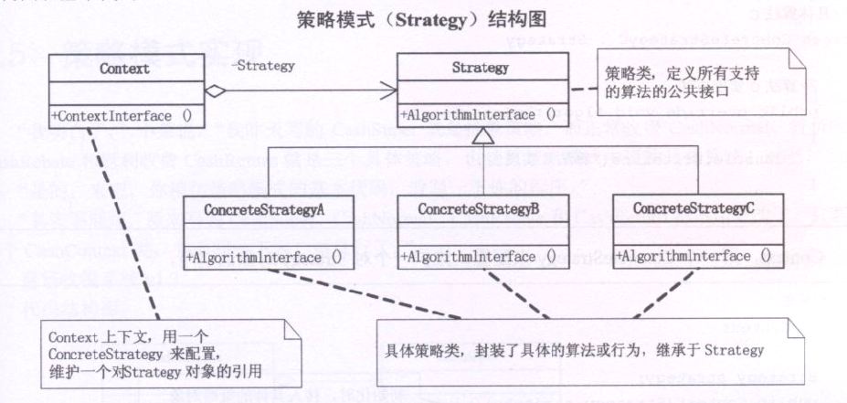

#### 策略模式---商场促销(超市收银系统.)

   基于简单工厂模式的商场促销,不是很好,每次维护或者扩展收费方式都要改动这个工厂.通过策略模式,会有更好的效果.
   
   策略模式定义了算法家族,分别封装起来,让他们之间可以互相替换,此模式让算法的变化,不会影响到使用算法的客户.
   商场收银时候的促销,打八折,满300-100 实际上都是算法.
   
   
   
   
   策略模式封装变化,封装算法的  
   在实践中,可以用它来封装几乎任何类型的规则,只要在分析过程中听到需要在不同的时间应用不同的业务规则,就可以考虑使用策略模式'
   
   在基本的策略模式中,选择所用的具体实现的职责由客户端对象承担,并转给策略模式的Context对象.(在纯策略模式的客户端可以清楚的看到),
   这本身并没有接触客户端需要选择判断(不同的条件创造算法对象)的压力.而策略模式与工厂模式结合之后,选择具体实现的职责也可以由Context来承担
   (可以在简单工厂模式和策略模式结合中清楚地看到),最大化减轻了客户端的职责.
   
   
   在CashContext中还是用到了switch 当我们需要增加一种算法,就必须要更改CashContext中的switch代码,还是让人不爽.
   可以利用反射技术(反射反射,程序员的快乐)来解决 那就是抽象工厂!!
   
   
   