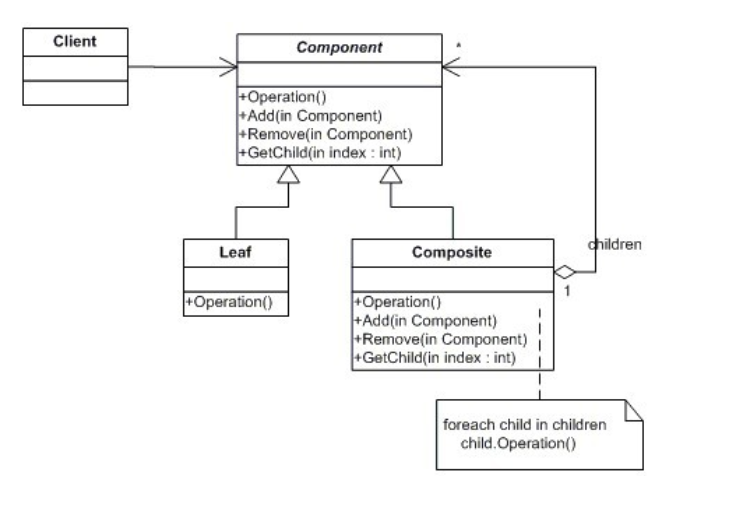
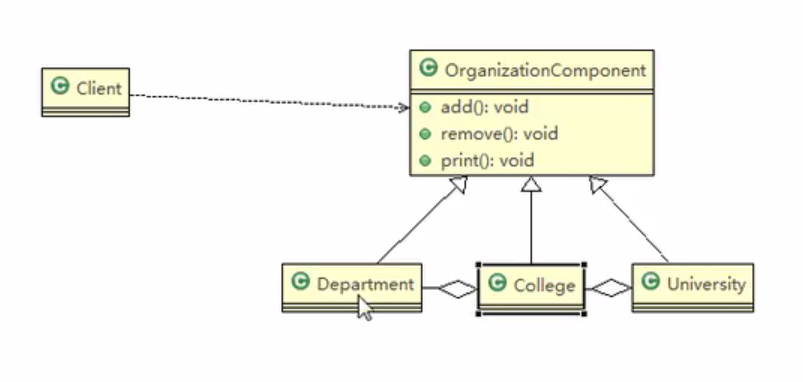
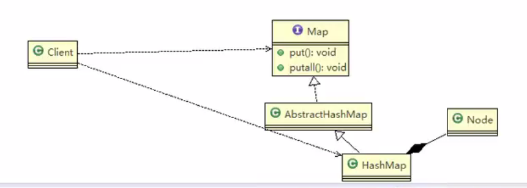

组合模式又叫 '部分整体模式'  
描述的是部分和整体的关系,创建了对象组的树形结构,将对象组合成了树状结构,

属于 结构型模式

1.**Component** :这是组合中的对象声明接口(可以是抽象类或者接口),  
在适当的情况下,它会实现所有类共有的接口默认行为  
用于访问和管理Component子部件  
2.**Leaf** :
在组合中表示叶子节点,没有子节点,他定义组合内元素的行为,充当被管理者(专业,系)  
3.**Composite**: 非叶子节点,用于存储子部件,在Component接口中实现子部件的相关操作.
比如Add Delet操作.充当管理者.(学校)

组合可以操作子节点和叶子,但是可能不具有叶子的某些行为.

##### 组合模式解决的问题:
当处理的对象可以生成一颗树形结构的时候(学院院系),我们对树上的节点和叶子进行操作的时候,
它能够提供统一的方式,不必考虑他是叶子还是节点.

composite下面是Leaf 

源码中的体现: Map

1.Map是一个抽象的构建(类似Component)  
2.Hashmap是中间构建(Composite) 实现继承了相关方法 put,putAll 
3.Node是HashMap的静态内部类,类似Leaf叶子结点,里面就没有put,putAll  
    ``static class Node<K,V> implement Map.Entry<K,V>
    
    
    
##### 组合模式的注意事项和细节:
1.简化客户端的操作,客户端不关系叶子或者是部分.   
2.具有强扩展性,只要改变内部的层次关系,客户端不用做出改动,   
3.方便创建复杂的层次结构.  
4.遍历组织机构,或者对象具有树形结构时,非常适合使用组合模式.  
5.要求较高的抽象性.如果节点和叶子有很多差异性的话,比如很多的方法和属性不一样,不适合使用组合模式.
