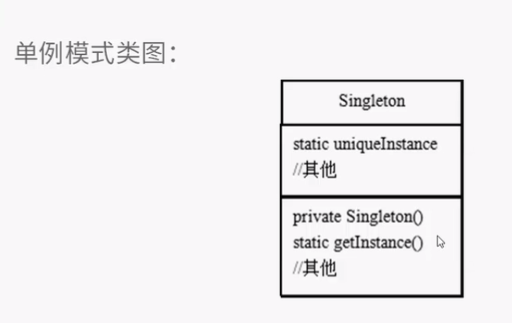

有些对象我们只需要一个,线程池,缓存,硬件设备等.

#### 作用:
确保一个类中最多只有一个实力,并提供一个全局访问点.

#### 途径:
 将构造方法私有化.外面不能创建对象.,让类自己new对象.封闭了外部创建对象的可能.

### 优化
 当多线程存在的时候,可能两个线程能获得两个经典单例模式的对象.单例模式便失效了.

1. 将getInstance() 添加同步锁,synchronized.但是同步锁消耗资源很多.可行,但是只适用于少次数的调用.

2. '急切' 创建对象. 一开始运行就直接创建对象.
 这种方式会浪费内存资源,因为可能这里new的对象在项目中都不会使用到.
 private static ChocolateFactory uniqeInstance = new ChocolateFactory();
 
3. 双重检查加锁法:代码多一些
   给创建对象的那个if语句进行加锁.保证了不创建无用对象,也不过多因为synchronized浪费资源.
   volatile 关键字要加到private的巧克力工厂对象.