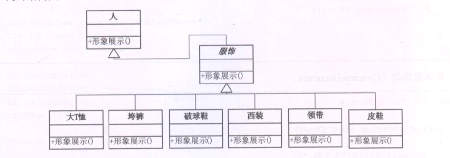

### 装饰者模式
   动态的给一个对象添加一些额外的职责,就增加功能来说,装饰者模式比生成子类更加灵活.
    
    
.PNG)

1.Component: 是一个抽象的超类(接口)   
2.ConcreteComponent:超类的实现类,表示主体,用来被包装的实体.  
3.Decorator:表示包装,内含Component接口对象.

对于Component来说,无需知道Decorator的存在的,ConcreteComponent是具体的装饰对象.起到给Component添加职责的功能.

千万不要死学习,当只有一个待包装对象的时候,无需抽象,只有一中装饰品的时候,也无需抽象.
下面的也可以:

    

### 装饰者模式的关键点:

- 传统的面向对象,继承关系复杂的时候,类会爆炸,复杂度爆炸.
  
- 装饰者模式就像打包快递,  
  -   主体:电脑,手机,平板(咖啡,茶,可乐)
  -   包装:泡沫,纸板,外箱(糖等各种调料)

使用装饰者模式可以简化包装类和主体类的组合关系,防止产生类爆炸.维护和扩展非常的方便.

### 装饰者模式和建造者模式的区别

建造者模式要求建造的过程是稳定的,而装饰者模式的建造过程是不稳定的,比如装饰的顺序可以随意的更改.  
装饰者模式需要将所需的功能按正确的顺序串联起来进行控制.(依靠在客户端调用ConcreteDecorator的顺序来串联)
        
        
### 总结
装饰者模式是为已有功能动态的添加更多更能的一种方式.  
当系统需要新功能的时候,向旧的类中添加了新的代码,这些新添加的代码通常装饰了原有类的核心职责或行为,这样增加了主类的复杂度
而且某项要加入的东西仅仅是为了满足某种特定情况下才会执行的特殊行为需要.
装饰者模式提出,把每个要装饰的功能放在单独的类中,并让这个类包装所要装饰的对象,因此当需要执行特定的行为的时候,客户代码就可以在运行时
有选择的按顺序的使用装饰功能包装对象了. 

装饰者模式的优点:把类中的装饰功能从类中搬移出去,可以简化原来的类.    