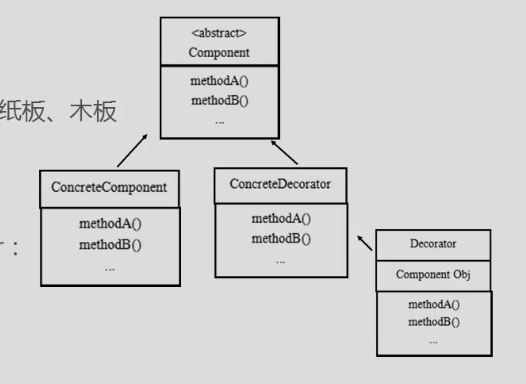

##### **接口回调:**

    public class Deal{
        public void doSth(Father father){
            father.fatherFunc();//用到接口Father的功能
            ... ...//处理其他事务
        }
    }
    
    -----------------------------------------------------------    
    Father fatherA = new SonA();
    Father fatherB = new SonB(); 
    Father fatherC = new SonC();
    
    <!--类来调用接口引用(该引用指向一个实现类的对象实例),然后接口去找他的实现类.-->
    deal.doSth(fatherA);//调用的是SonA对接口的实现
    deal.doSth(fatherB);//调用的是SonB对接口的实现
    deal.doSth(fatherC);//调用的是SonC对接口的实现

这就达到了具体实现与事务处理的解耦。  
在类Deal处理事务过程中不需要知道实现接口的子类，这样可以方便的扩充和维护代码，即设计模式的开闭原则（对扩展开放，对修改关闭）。  
上面的代码中，fatherA、fatherB、fatherC都可以称为接口回调对象，它们虽然被声明为接口Father类型，但是在实例化时却是实现的某个子类。

#### **向上转型:**

    子类对象赋值给父类的引用.  A a=new B(); 
    向上转型并非是将B自动向上转型为A的对象，相反它是从另一种角度去理解向上两字的：
        它是对A的对象的方法的扩充，即A的对象只可访问B从A中继承来的和B重写A的方法。
        **其它的方法都不能访问。即使是A中的私有成员方法。a的私有成员方法不能被继承,所以子类对象没有这个方法.**

***开放-关闭原则:对扩展开放,对修改已有代码进行关闭.***

#### 装饰者模式的关键点:

- 传统的面向对象,继承关系复杂的时候,类会爆炸,复杂度爆炸.
  
- 装饰者模式就像打包快递,  
  -   主体:电脑,手机,平板(咖啡,茶,可乐)
  -   包装:泡沫,纸板,外箱(糖等各种调料)

使用装饰者模式可以简化包装类和主体类的组合关系,防止产生类爆炸.维护和扩展非常的方便.

#### 类图:

  
1.Component: 是一个抽象的超类(接口)   
2.ConcreteComponent:超类的实现类,表示主体,用来被包装的实体.  
3.Decorator:表示包装,内含Component接口对象.

